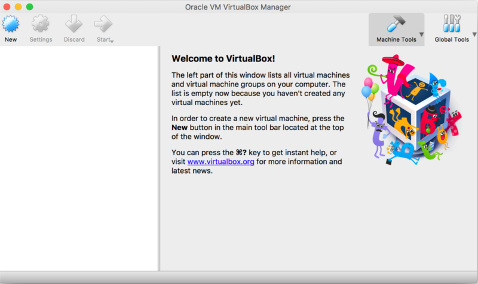
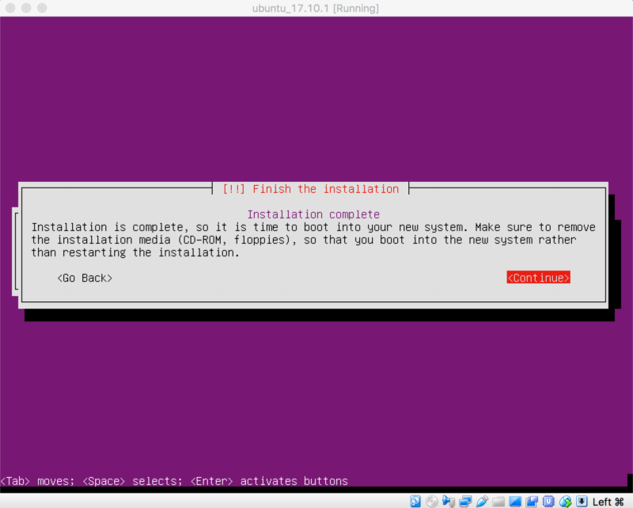

# Introduction to Linux
{id: introduction-to-linux}

## Slides
{id: slides}

https://code-maven.com/ws1

## About us
{id: about-us}

* Yonit Gruber-Hazani
* Gabor Szabo
* DevOps Workshops http://devops-workshops.code-maven.com/

## About you
{id: about-you}

* Name
* Company
* What do you do
* Something interesting about you

## Prerequisites for the installations
{id: installation}

* Download [VirtualBox](https://www.virtualbox.org/).
* Install VirtualBox.
* Download an ISO image of a Linux distribution.
* Latest [Ubuntu Server](https://www.ubuntu.com/download/server) - 17.10.1

## What is Linux?
{id: what-is-linux} 

* The kernel
* The Operating System - thousands of programs
* The Distribution - a group effort


## Linux Distributions
{id: linux-distributions}

* Debian
* Ubuntu
* Mint
* Fedora
* RedHat
* CentOS
* ... [DistroWatch](https://distrowatch.com/)

## What is BSD?
{id: bsd}

* FreeBSD
* NetBSD
* OpenBSD

## What are Linux distributions?
{id: what-are-linux-distributions}

* Collection of packages
* Linux kernel
* Editors
* Web server
* Database server
* etc.

## Configure Virtualbox
{id: configure-virtualbox}

* Open VirtualBox - Press the "new" button on the left


* If you type in the name "ubuntu_17.10.1" it will seyup the type to linux and the version to ubuntu 64-bit for you
if not, you can do that your selfs. 


* just continue with the suggested setup the virtualbox is suggesting for you


* open the config section of your new server, and in the storage section, 
you can change the cd to load from the ubuntu iso file you have downloaded before, 
after saving this setup you can start the new host:


## Set up Linux
{id: setup-linux}

* start the install in your preffered language, when you get to the hostname section choose whatever you want


* when the install is complete , it will umount the ubuntu image we setup in the beginning, you just continue to reboot:


* When you are done installing after the reboot the host screen should look like this:


## Log in to the computer on the VirtualBox console
{id: log-in-to-computer-on-the-virtualbox-console}

## Configure Host-only network
{id: configure-host-only-network}

* Virtual Box / Preferences / Network / Host only network
* + to add one (vboxnet0)
* Select your VirtualBox / Setup / Network
* Adapter 1 is set to NAT.
* Click to Adapter 2
* Set it to "Host only" and select the vboxnet0

## Linux users: you, root, and sudo
{id: linux-users-sudo}

* sudo

## Package repositories
{id: package-repositories}

* Like an Appstore or Google play just free and Open Source
* yum (.rpm) (Fedora, RedHat, CentOS, ...)
* apt (.deb) (Debian, Ubuntu, Mint, ...)

## Update Deb-based packages
{id: update-deb-based-packages}

```
$ sudo apt-get update
$ sudo apt-get upgrade
```

## Update rpm-based packages
{id: update-rpm-based-packages}

```
$ sudo yum update
```

## Configure host-only network on Ubuntu
{id: configure-host-only-network-for-ubuntu}

```
$ ifconfig -a
$ sudo apt-get install ifupdown
```

edit `/etc/network/interfaces` and add

```
auto enp0s8
iface enp0s8 inet static
address 192.168.56.10
netmask 255.255.255.0
```

Run `sudo ifup enp0s8`

## Install ssh server
{id: install-ssh-server}

```
$ sudo apt-get install ssh
```

Try it:

```
$ ssh localhost
$ ifconfig | grep inet
```

## Use Putty to connect to the machine
{id: use-putty-to-connect-to-the-machine}

* [Download putty.exe](https://www.chiark.greenend.org.uk/~sgtatham/putty/latest.html) (No need for the .msi file)
* Run it from the download directory or from the desktop

## Turn off the Linux box
{id: turn-off-the-linux-box}

* halt command
* Power off VirtualBox
* Start it again

## The Linux Filesystem
{id: the-linux-filesystem}

The filesystem starting at /

## Navigate in the filesystem
{id: navigate-in-the-filesystem}

* ls
* cd some/dir
* cd ..
* cd

## Create and remove directory
{id: create-and-remove-directory}

* mkdir
* rmdir

## Nano file editor
{id: nano-file-editor}

* nano
* create a new file
* edit the file again

## Remove files
{id: remove-files}

* rm

## Install Nginx
{id: install-nginx}

```
sudo apt-get -y install nginx
```

```
curl http://localhost:80
```

The default configuration file of Nginx: is /etc/nginx/sites-enabled/default

Edit /var/www/html/index.nginx-debian.html
Then reload the page using `curl` and your browser and observe the change.

## Resources
{id: resources}

* [Our Meetup page](https://www.meetup.com/Code-Mavens/)
* [Our Facebook page](https://www.facebook.com/Devops.Workshops)
* [Facebook group](https://www.facebook.com/groups/188753948553382/)

## Linux Resources
{id: linux-resources}

* [Linux for Power users](https://code-maven.com/slides/linux/) Slides of Gabor

