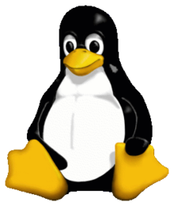

# Introduction
{id: introduction}

## Content
{id: content}

* Understanding the Unix/Linux philosophy.
* Basic use of the GUI to get started.
* The shell - the command line interface.

## What is Linux?
{id: what-is-linux}
{i: kernel}

* The [kernel](https://www.kernel.org/).
* The distribution.

Tux, the Linux mascot:

## Vendors and Distributions
{id: linux-distributions}
{i: Debian}
{i: Ubuntu}
{i: Red Hat}
{i: Fedora}
{i: CentOS}
{i: SuSe}
{i: Gentoo}

* [Debian](http://www.debian.org/), community project.
* [Ubuntu](http://www.ubuntu.com/), a Debian derivative.
* [RHEL - Red Hat Enterprise Linux](http://www.redhat.com/), very commercial oriented.
* [Fedora](http://fedoraproject.org/), the community source of RedHat.
* [CentOS](http://www.centos.org/), a RedHat clone.
* [SuSe](https://www.suse.com/), the German distribution.
* [Open SuSe](http://www.opensuse.org/), the community edition of SuSE.
* [Gentoo](http://www.gentoo.org/), a kit
* [Open Mandriva](https://www.openmandriva.org/) (was Mandriva)
* ...
* [Distro Watch](https://distrowatch.com/)

## Linux History
{id: linux-history}

* 1983 September 27 - GNU announced by Richard Stallman (emacs, gcc).
* 1985 - FSF - Free Software Foundation.
* 1991 September 17 Linus Torvalds releases v0.01 of the Linux kernel.
* 1991-1992 - Early distributions [history](https://lwn.net/Articles/91371/)
* 1994-1995 Main stream distributions appear.
* 2008 October 22 - First Android based mobile phone released.

## GNU
{id: gnu}
{i: GNU}

* GNU - GNU is Not Unix
* GNU/Linux

The Gnu mascot:

## License - Free and Open Source
{id: license}
{i: GPL}
{i: LGPL}
{i: Apache}
{i: BSD}

* GPL 2
* GPL 3
* LGPL
* ...
* Apache
* BSD

## Free Software
{id: free-software}

Free as in Free speach or freedom.

1. Run.
1. Study (source code).
1. Modify.
1. Redistribute.

[Free Software Definition](https://www.gnu.org/philosophy/free-sw.en.html)

## Unix/Linux Design Principles
{id: linux-features}

* Hierarchical filesystem with a single root /.
* Eveything is a file.
* Small single-purpose programs.
* Pipe programs together to accomplish more complex tasks.
* All configuration is stored as text. ASCII or UTF-8.

## Unix vs Linux?
{id: unix-vs-linux}
{i: HPUX}
{i: Irix}
{i: AIX}
{i: Solaris}
{i: OSX}
{i: FreeBSD}
{i: NetBSD}
{i: OpenBSD}

* HPUX, AIX, Irix, Solaris, etc.
* FreeBSD, NetBSD, OpenBSD
* OSX
* GNU/Linux

## Resources and Getting Help
{id: linux-resources}

* Manual pages
* Searching the Internet for answers
* [Stack Overflow](http://stackoverflow.com/)
* [SuperUser](http://superuser.com/)
* [Unix/Linux command Cheat Sheet](http://fosswire.com/post/2007/08/unixlinux-command-cheat-sheet/)

## Linux in Israel
{id: linux-in-israel}

* [IGLU - The Israeli Group of Linux Users](http://iglu.org.il/)
* [Ha Makor NGO](https://www.hamakor.org.il/)
* [What's Up web forum](http://whatsup.org.il/)
* [linux-il mailing list](https://www.hamakor.org.il/mailing-lists/linux-il.html)

## Installation
{id: installation-of-linux}

* [VirtualBox](https://www.virtualbox.org/)
* [Download Ubuntu Desktop](http://www.ubuntu.com/download) (Choose latest YY.MM - 16.04)
* [Putty](http://www.chiark.greenend.org.uk/~sgtatham/putty/download.html)
* [Xming - X Server for Windows](https://sourceforge.net/projects/xming/)
* LiveCD vs Installation
* Install Guest Addition CD image (Under Devices)

## Exercise: Install Linux
{id: exercise-install}

